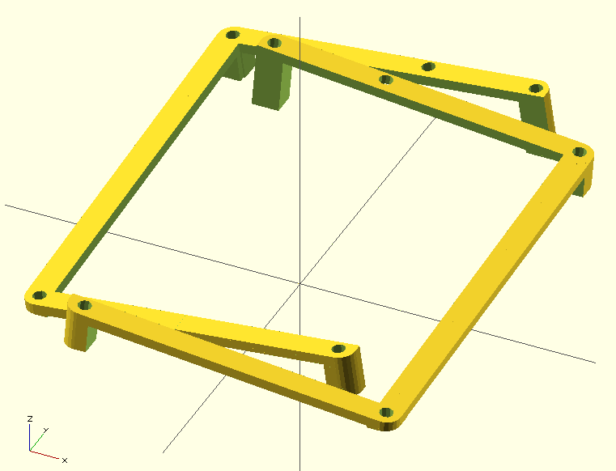

## Fork info

I (bchociej) forked this repo from [adereth/ergodox-tent](https://github.com/adereth/ergodox-tent) and implemented new features, including tilting, native millimeter dimensions, and full-hand version.

I didn't know what I was doing when I cloned this repo. Maybe you don't either! Here's how I got things working:

1.	Install leiningen (a shell script) into my $PATH from here: [lein](https://raw.githubusercontent.com/technomancy/leiningen/stable/bin/lein)
2.	Install openscad (I used my package manager for this)
3.	Start lein from the root directory of this repo using `$ lein repl`
4.	Make some changes to [src/ergodox_stand/core.clj](core.clj)
5.	In the lein REPL (at the `user=> ` prompt), enter `(use 'ergodox-stand.core :reload)`
6.	Open [stand.scad](resources/stand.scad) in openscad
7.	Repeat steps 4-6

You can use openscad to Build (F6) and Export to .stl format too.

To fulfill the various licenses: this is based on work by [adereth](https://github.com/adereth/), and I have modified it as described above. I hereby release modifications under the same licensing conditions as the original work.

# ergodox-tent

A tent for the [Ergodox acrylic case designed by Litster](http://deskthority.net/wiki/ErgoDox).  The design was implemented using [clj-scad](https://github.com/farrellm/scad-clj).

## Usage

If you're just interested in printing your own, just download [resources/stand.stl](resources/stand.stl) and feed it into your favorite software for 3D printing.

If you'd like to contribute, I'd prefer you make changes to the original Clojure source.  I've also included the [generated SCAD](resources/stand.scad) if you want to experiment and don't have a Clojure environment set up.

## License

All source is distributed under the Eclipse Public License either version 1.0 or (at
your option) any later version.

The stand design and all images are released under the [Creative Commons Attribution-ShareAlike 4.0 International License (CC BY-SA 4.0)](http://creativecommons.org/licenses/by-sa/4.0/)
